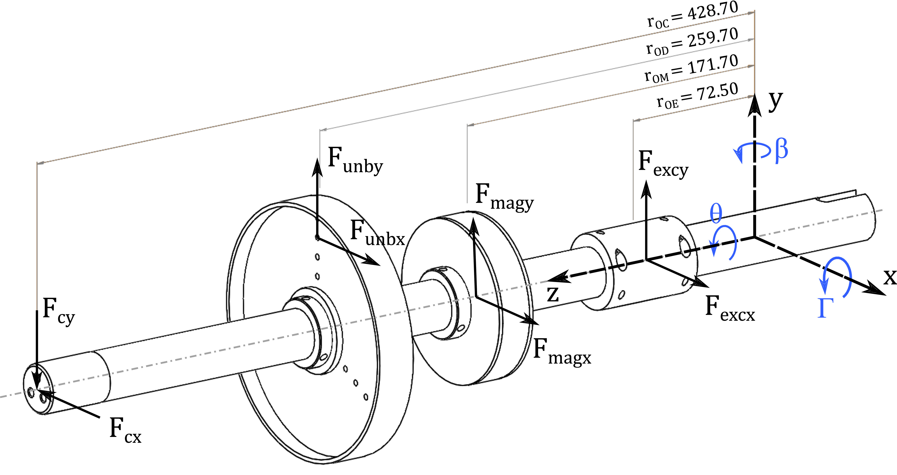

Rotor-Stator Impact Code
========================

A rotordynamical object-oriented program for simulating impact between a rotor and a stator.
The code was created as part of the master's thesis "[Analytical and Numerical Modeling of Contact Forces in Rotordynamics with Experimental Verification](doc/svea-abma-thesis.pdf)" conducted at the Technical University of Denmark (DTU) in 2019.

The specific rotor dynamics are implemented via the equations of motion in `dydt.m`, the currently implemented system is seen in the figure below.

### Usage
- An example of a program is given in `sim1.m`
- System parameters are set in `settings.toml`

--------------------------------------------------
### Simulation Example
Below a result obtained from the code is seen:

